# JsonLD署名検証 (チャンネル投稿) テスト — テストごとの挙動とシーケンス図

対象: `test/json-ld-channel.test.ts` (全14ケース)
登場人物: Tester (vitest) / Stub (`z.test` 配信代行) / Inbox (`a.test` の inbox・202で即時応答) / Queue (BullMQ) / Proc (`InboxProcessorService`) / AP (`ApInboxService`) / DB

前提: `beforeAll` で alice (`a.test`) がチャンネルを作成し、チャンネルアクターURI (`https://a.test/users/<actorId>`) を fixture の `{{recipient}}` / `{{channelActor}}` に注入する。cc に自ホスト (`a.test`) が含まれるため、HTTP有効経路でもLD検証が試行される。
Announce系は `10-ch-original` を先に取り込ませてから `11-ch-announce` (配送毎にstubが一意id採番) を配送する。

## C-P1. チャンネル宛Create・HTTP署名のみ (LDなし) は取り込まれる (none/valid)

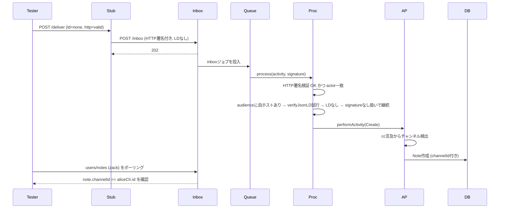
判定: `strictEqual(note.channelId, aliceCh.id)`。

## C-P2. チャンネル宛Create・HTTP有効+LD有効 は取り込まれる (valid/valid)

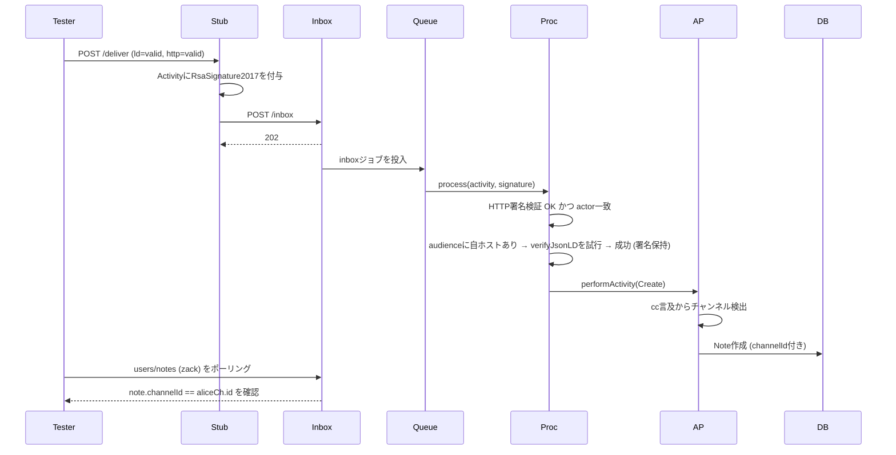
判定: `strictEqual(note.channelId, aliceCh.id)`。

## C-P3. チャンネル宛Create・HTTP破壊+LD有効 はフォールバックで取り込まれる (valid/broken)

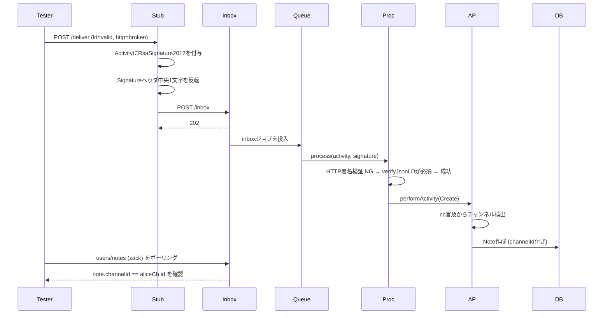
判定: `strictEqual(note.channelId, aliceCh.id)`。

## C-P4. チャンネル宛Create・HTTP有効+LD改ざん は剥がして取り込まれる (tampered-body/valid)

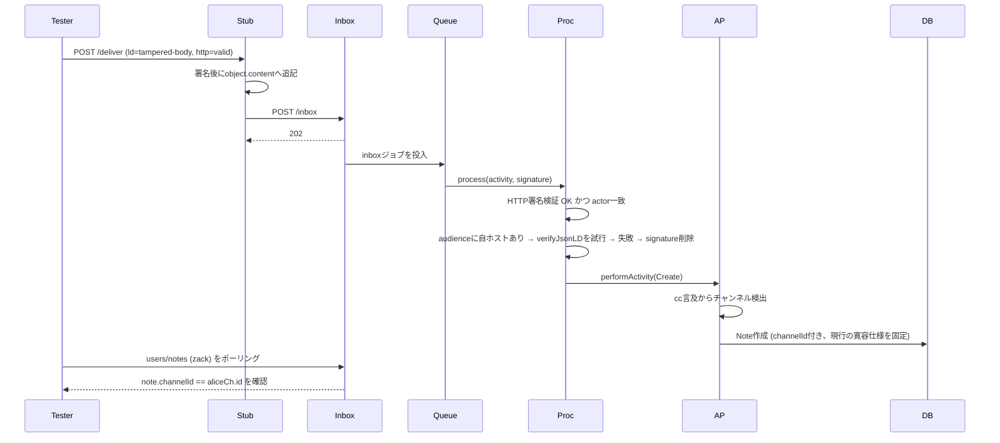
判定: `strictEqual(note.channelId, aliceCh.id)`。

## C-N1. チャンネル宛Create・HTTP破壊+LDなし は拒否される (none/broken)

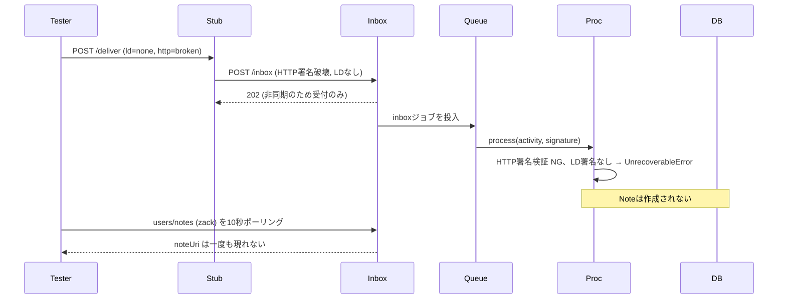
判定: `assertFederationTestNoteNotIngested`。

## C-N2. チャンネル宛Create・HTTP破壊+LD本文改ざん は拒否される (tampered-body/broken)

判定: `assertFederationTestNoteNotIngested`。

## C-N3. チャンネル宛Create・HTTP破壊+LD署名値改ざん は拒否される (tampered-value/broken)

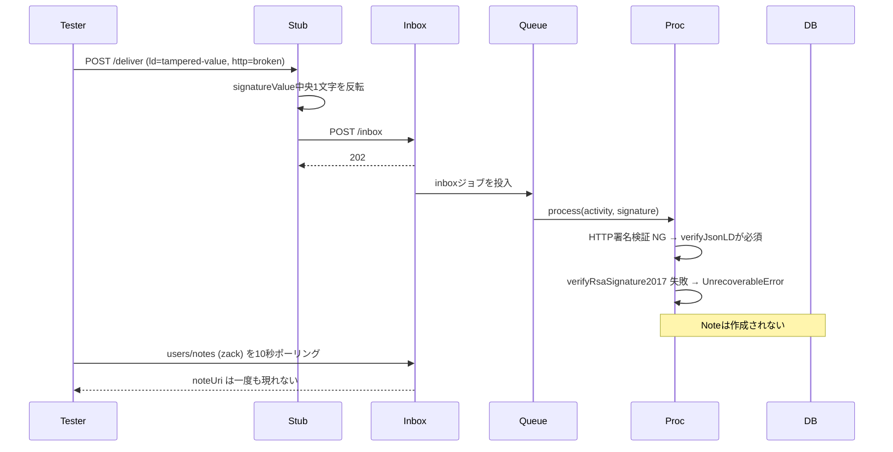
判定: `assertFederationTestNoteNotIngested`。

## C-N4. チャンネル宛Create・HTTP破壊+LD型不正 は拒否される (wrong-type/broken)

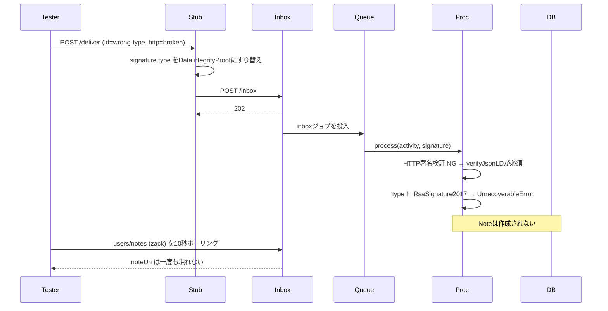
判定: `assertFederationTestNoteNotIngested`。

## C-N5. チャンネル宛Create・HTTP破壊+LD creator不一致 は拒否される (creator-mismatch/broken)

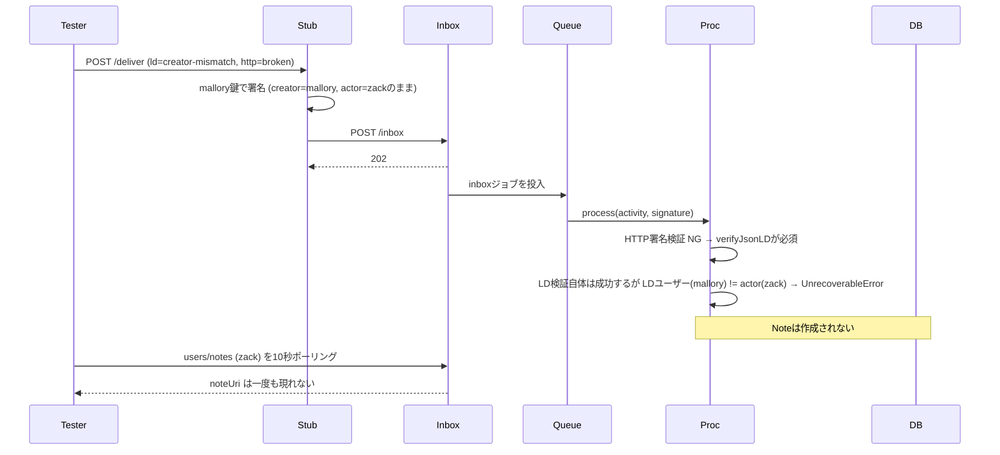
判定: `assertFederationTestNoteNotIngested`。

## A-P1. チャンネル宛Announce・HTTP有効+LD有効 はリノートとして取り込まれる (valid/valid)

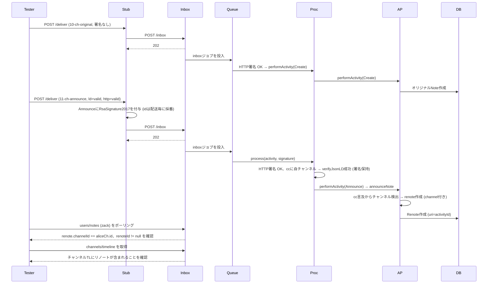
判定: `channelId` 一致、`renoteId` 非null、チャンネルTL含有。

## A-P2. チャンネル宛Announce・HTTP破壊+LD有効 はフォールバックで取り込まれる (valid/broken)

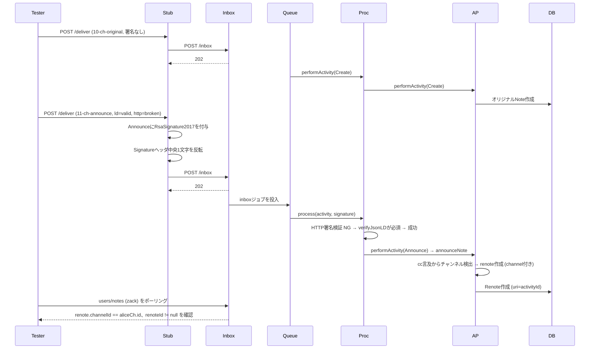
判定: `channelId` 一致、`renoteId` 非null。

## A-N1. チャンネル宛Announce・HTTP破壊+LDなし は拒否される (none/broken)

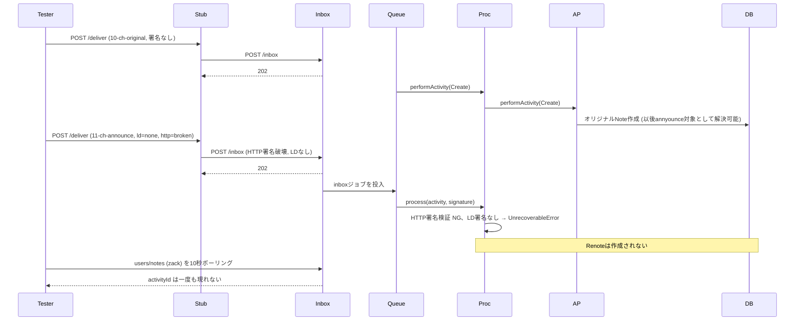
判定: `assertFederationTestNoteNotIngested(alice, activityId)`。

## A-N2. チャンネル宛Announce・HTTP破壊+LD本文改ざん は拒否される (tampered-body/broken)

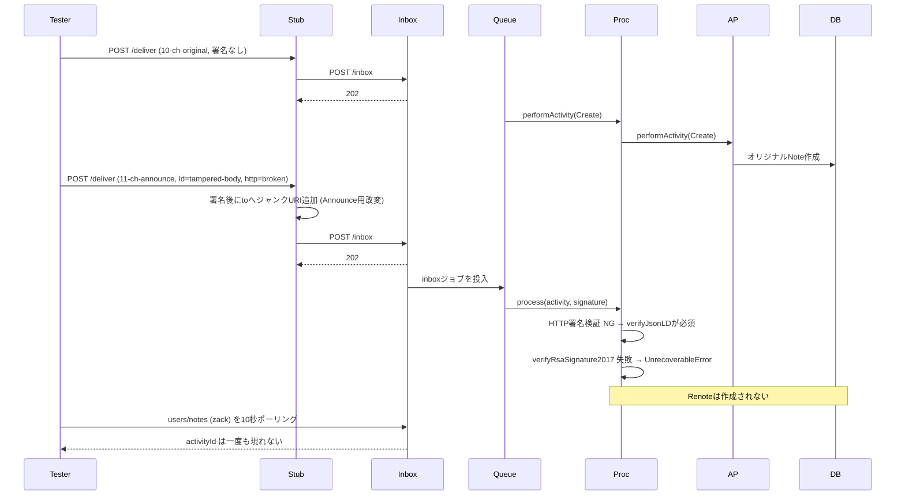
判定: `assertFederationTestNoteNotIngested(alice, activityId)`。

## A-N3. チャンネル宛Announce・HTTP破壊+LD型不正 は拒否される (wrong-type/broken)

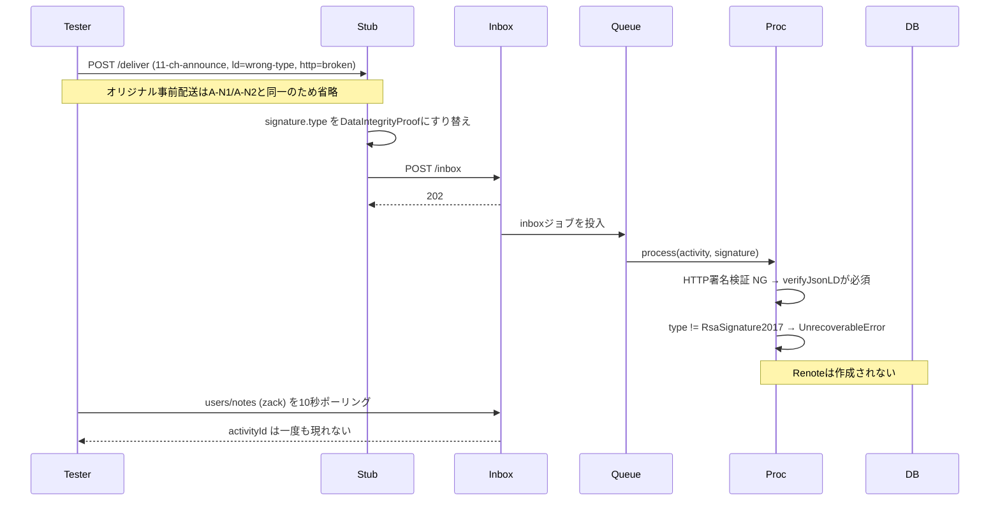
判定: `assertFederationTestNoteNotIngested(alice, activityId)`。
備考: `creator-mismatch` / `tampered-value` は Create 側と同一 `verifyJsonLD` 経路で検証済みのため Announce では省略。

## R-P1. 正規LDのAnnounceはフォロワーのサーバーへ中継される (valid/valid)

前提: `bob` (`b.test`) がzackとチャンネルをフォロー済み (中継先の観測者)。

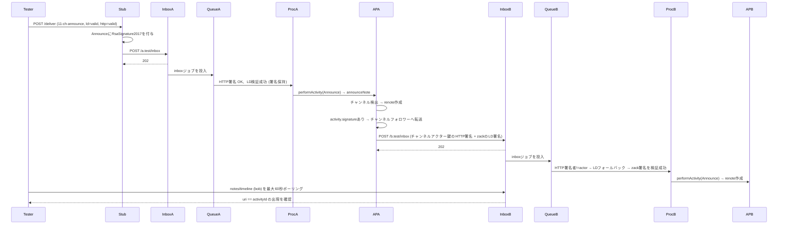
判定: a.testで `channelId` 一致のチャンネルリノート作成＋b.testのbob HTLに `uri == activityId` が出現。

## R-N1. 改竄LDのAnnounceは取り込まれるが中継されない (tampered-body/valid)

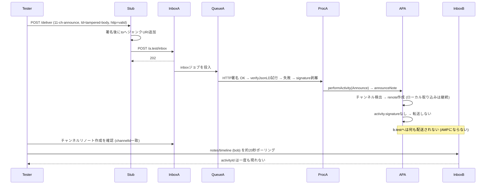
判定: a.testで取り込み確認＋b.test HTL不在確認。

## R-N2. LDなしのAnnounceは取り込まれるが中継されない (none/valid)

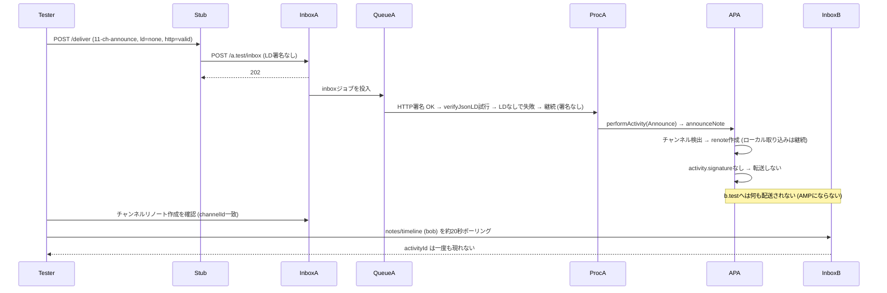
判定: a.testで取り込み確認＋b.test HTL不在確認。
