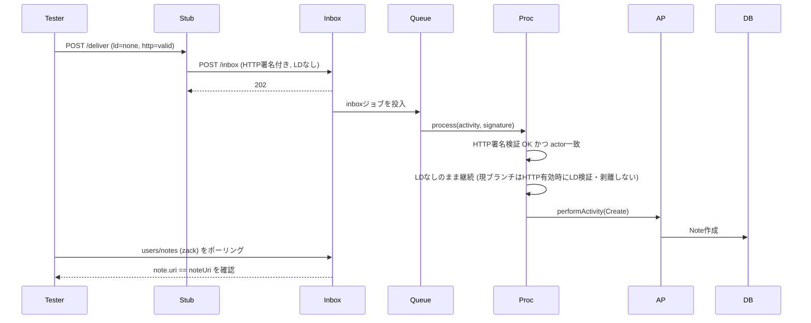
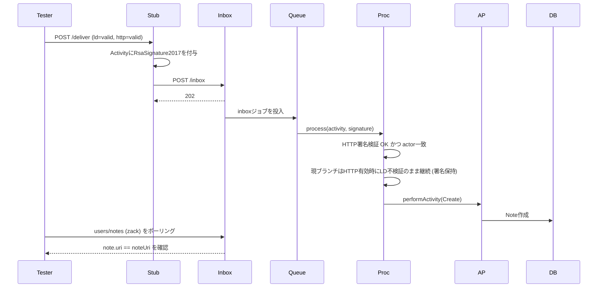
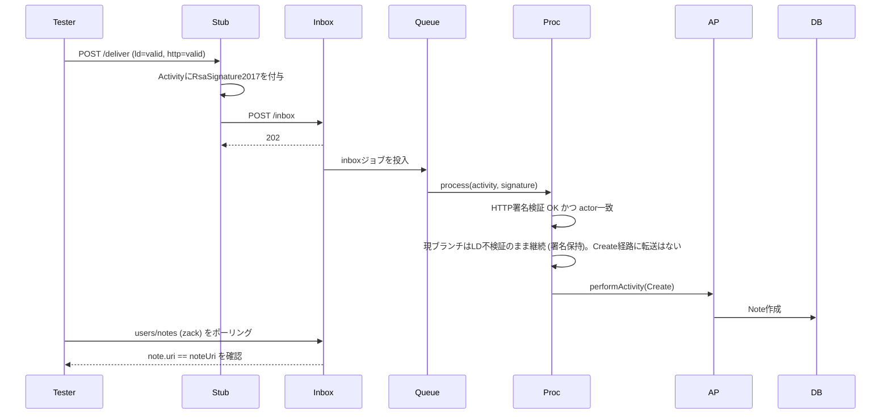
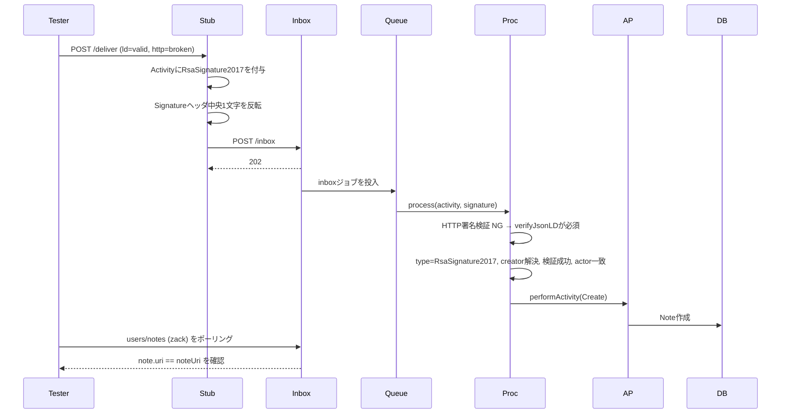
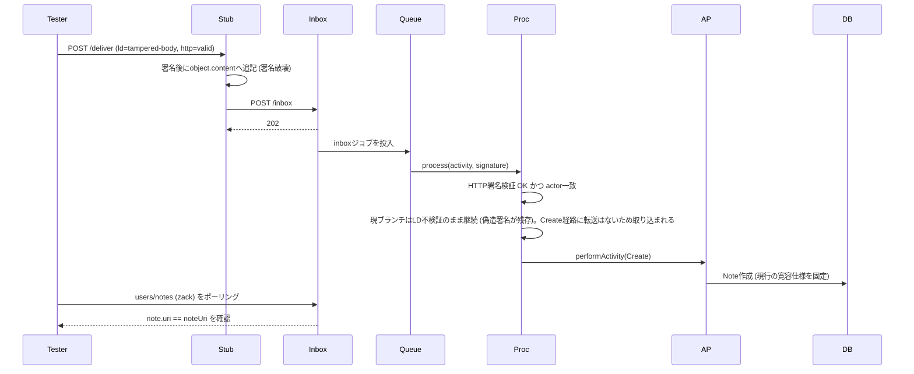
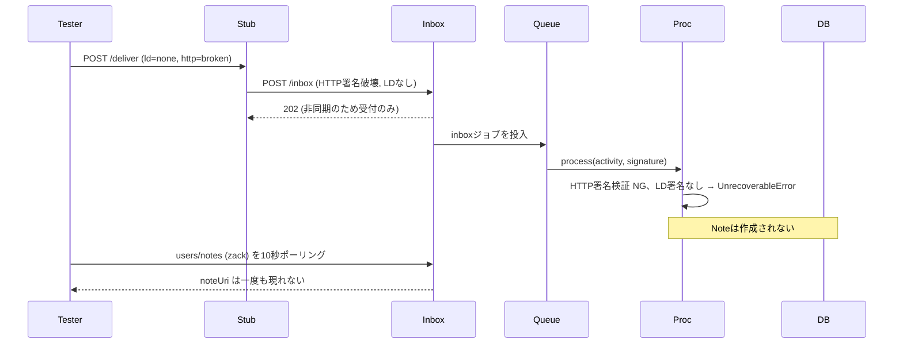
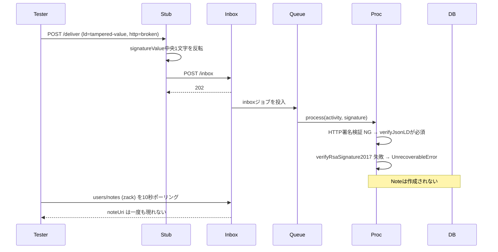
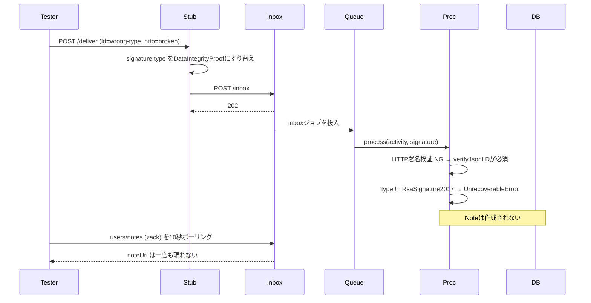
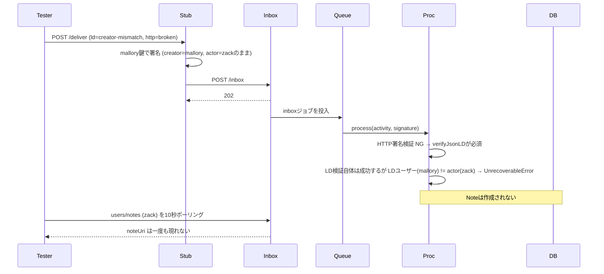
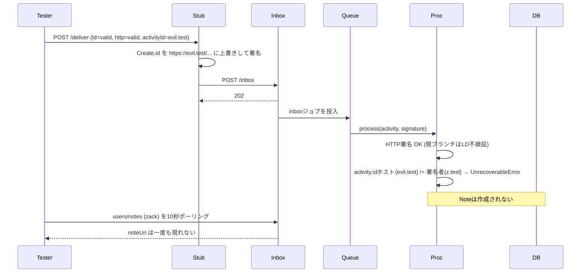

# JsonLD署名検証テスト — テストごとの挙動とシーケンス図

対象: `test/json-ld-signature.test.ts` (全11ケース)
登場人物: Tester (vitest) / Stub (`z.test` 配信代行) / Inbox (`b.test` の inbox・202で即時応答) / Queue (BullMQ) / Proc (`InboxProcessorService`) / AP (`ApInboxService`) / DB

フラグ意味: `http=valid/broken` (HTTP Signatureの正否)、`ld=none/valid/改ざん系` (LD署名の状態)。
`01-mention-self` は cc に自ホスト (`b.test`) 言及あり、`02-public-only` は言及なし。

## P1. HTTP署名のみ (LDなし) は取り込まれる (`02-public-only`, none/valid)

判定: `strictEqual(note.uri, noteUri)`。

## P2. HTTP有効+LD有効 (self言及あり) は取り込まれる (`01-mention-self`, valid/valid)

判定: `strictEqual(note.uri, noteUri)`。

## P3. HTTP有効+LD有効 (self言及なし) はLDを剥がして取り込まれる (`02-public-only`, valid/valid)

判定: `strictEqual(note.uri, noteUri)`。

## P4. HTTP破壊+LD有効 はLDフォールバックで取り込まれる (`01-mention-self`, valid/broken)

判定: `strictEqual(note.uri, noteUri)`。

## P5. HTTP有効+LD改ざん はLDを剥がして取り込まれる (`01-mention-self`, tampered-body/valid)

判定: `strictEqual(note.uri, noteUri)`。

## N1. HTTP破壊+LDなし は拒否される (`01-mention-self`, none/broken)

判定: `assertFederationTestNoteNotIngested` (出現したら失敗)。

## N2. HTTP破壊+LD本文改ざん は拒否される (`01-mention-self`, tampered-body/broken)

判定: `assertFederationTestNoteNotIngested`。

## N3. HTTP破壊+LD署名値改ざん は拒否される (`01-mention-self`, tampered-value/broken)

判定: `assertFederationTestNoteNotIngested`。

## N4. HTTP破壊+LD型不正 は拒否される (`01-mention-self`, wrong-type/broken)

判定: `assertFederationTestNoteNotIngested`。

## N5. HTTP破壊+LD creator不一致 (mallory署名) は拒否される (`01-mention-self`, creator-mismatch/broken)

判定: `assertFederationTestNoteNotIngested`。

## N6. activity.idホスト不一致 は拒否される (`01-mention-self`, valid/valid + activityId上書き)

判定: `assertFederationTestNoteNotIngested`。
